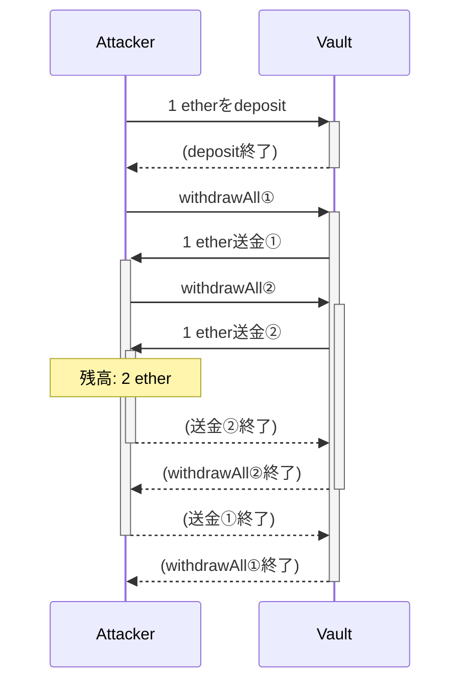
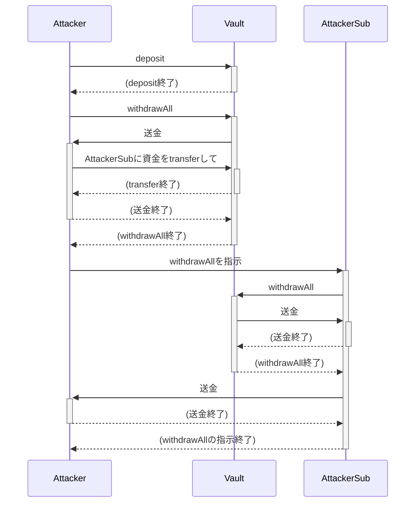
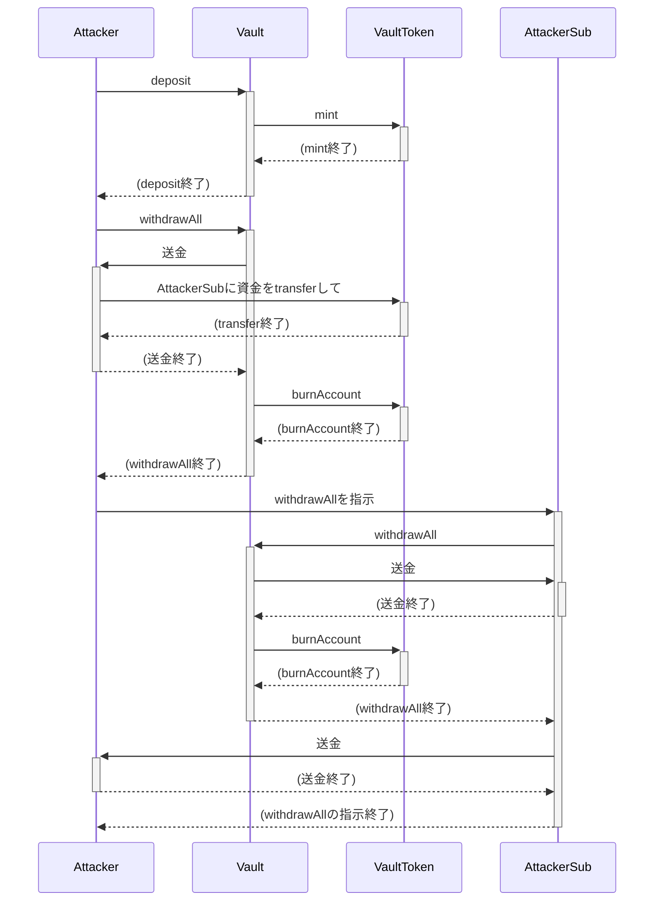

# Reentrancy Attacks

**目次**

- [Reentrancy Attack とは](#reentrancy-attackとは)
  - [Reentrancy Attack の具体例](#reentrancy-attackの具体例)
  - [演習](#演習)
- [Reentrancy Attack の対策](#reentrancy-attackの対策)
  - [Checks-Effects-Interactions パターンの遵守](#checks-effects-interactionsパターンの遵守)
  - [Mutex (Reentrancy Guard)の導入](#mutex-reentrancy-guardの導入)
  - [Pull Payment メカニズムへの変更](#pull-paymentメカニズムへの変更)
- [Reentrancy Attack の類型](#reentrancy-attackの類型)
  - [Single-Function Reentrancy Attack](#single-function-reentrancy-attack)
    - [演習](#演習-1)
  - [Cross-Function Reentrancy Attack](#cross-function-reentrancy-attack)
    - [演習](#演習-2)
  - [Cross-Contract Reentrancy Attack](#cross-contract-reentrancy-attack)
    - [演習](#演習-3)
  - [Cross-Chain Reentrancy Attack](#cross-chain-reentrancy-attack)
  - [Read-Only Reentrancy Attack](#read-only-reentrancy-attack)
    - [演習](#演習-4)
- [発展: Transient Storage Opcodes (`TLOAD`/`TSTORE`)](#発展-transient-storage-opcodes-tloadtstore)
- [参考: Reentrancy Attack を利用する CTF の問題](#参考-reentrancy-attackを利用するctfの問題)

## Reentrancy Attack とは

Reentrancy Attack とは、「ある関数の呼び出し中に、再度その関数あるいは（状態を共有する）別の関数を呼び出すことで、状態に不整合を起こす攻撃」のことです。

### Reentrancy Attack の具体例

具体的に Reentrancy Attack を見ていきましょう。
次の`Vault`コントラクトについて考えてみます。
以下、Solidity のバージョンは全て`^0.8.13`です。

```solidity
contract Vault {
    mapping(address => uint256) public balanceOf;

    function deposit() public payable {
        balanceOf[msg.sender] += msg.value;
    }

    function withdrawAll() public {
        require(balanceOf[msg.sender] > 0);
        (bool success,) = msg.sender.call{value: balanceOf[msg.sender]}("");
        require(success);
        balanceOf[msg.sender] = 0;
    }
}
```

`Vault`コントラクトには、`deposit`関数と`withdrawAll`関数の 2 つの関数が実装されています。
`deposit`関数を Ether の送金付きで呼び出すと、その Ether の額が`balanceOf[msg.sender]`に加算されます。
そして、`withdrawAll`関数でその預けた Ether を全額引き出せます。

この`Vault`コントラクトには Reentrancy Attack が適用できる脆弱性があります。
初期状態として、例えば、`Vault`コントラクトが 1 ether 保管しているとします。

攻撃者は以下の流れでその 1 ether を奪取できます。

1. `deposit`関数で 1 ether 送金する
2. `withdrawAll`関数を呼び出す
3. `withdrawAll`関数中の`call`による 1 ether の送金を、receive Ether 関数で受け取り、再度`withdrawAll`関数を呼び出す

図に表すと次のようになります。



このように、関数の呼び出し中に、もう一度その関数を呼び出すことが「reentrancy」と言われる所以になっています。

それでは、なぜこれで Ether が奪取されてしまうかについて詳しく追っていきます。
まず、原因の一つに`balanceOf`の更新が`call`の後にあることが挙げられます。
1 回目の`withdraw`関数を呼び出すと、`balanceOf[msg.sender]`が更新されないまま、2 回目の`withdraw`関数が実行されます。
つまり、残高チェックである`balanceOf[msg.sender] >= amount`の条件が満たされたままです。
関数の最後で`balanceOf[msg.sender]`が`0`になりますが、更新のタイミングが遅く、これでは不適切です。

参考までに、コードレベルで具体的に以下の処理が行われます。細かい処理を確認したい方は読んでみてください。

- 攻撃者が用意したコントラクトから`withdrawAll`関数が呼び出される
- `require(balanceOf[msg.sender] > 0);`のチェックが行われる
  - `balanceOf[msg.sender]`は 1 ether
- `msg.sender.call{value: balanceOf[msg.sender]}("")`が実行される
  - `msg.sender`は攻撃者が用意したコントラクトアドレス
  - `balanceOf[msg.sender]`は 1 ether
- 攻撃者が用意したコントラクトの`receive`関数にフォールバックする
- 再度`withdrawAll`関数が呼び出される
- `require(balanceOf[msg.sender] > 0);`のチェックが行われる
  - `balanceOf[msg.sender]`は更新されていないのでまだ 1 ether のまま
- `msg.sender.call{value: balanceOf[msg.sender]}("")`が実行される
- 攻撃者が用意したコントラクトの`receive`関数にフォールバックする
- この 2 回目の`receive`関数の実行が終了
- 2 回目の`msg.sender.call`の実行が終了し、`msg.sender`への 1 ether の送金が完了する
- 2 回目の`withdrawAll`関数の`require(success);`のチェックが行われる
  - `success`は`true`
- 2 回目の`withdrawAll`関数の`balanceOf[msg.sender] = 0;`が実行される
- 2 回目の`withdrawAll`関数の実行が終了する
- 1 回目の`receive`関数の実行が終了
- 1 回目の`msg.sender.call`の実行が終了し、`msg.sender`への 1 ether の送金が完了する
  - トータルで 2 ether 送金されたことになる
- 1 回目の`withdrawAll`関数の`require(success);`のチェックが行われる
  - この`success`も`true`
- 1 回目の`withdrawAll`関数の`balanceOf[msg.sender] = 0;`が実行される
  - 更新する前の時点で`balanceOf[msg.sender]`は既に`0`
- 1 回目の`withdrawAll`関数の実行が終了
- 攻撃者が用意したコントラクトに処理が戻る

### 演習

`reentrancy/challenge-single-function`ディレクトリの`Challenge.t.sol`を完成させて、`Vault`コントラクトへの Reentrancy Attack を成功させてください。

以下のコマンドを実行して、テストがパスしたら成功です。

```
forge test -vvv --match-path course/reentrancy/challenge-single-function/Challenge.t.sol
```

以下のコメントの間に自分のコード（攻撃コントラクト含む）を書いてください。それ以外は編集しないでください。

```
////////// YOUR CODE GOES HERE //////////

////////// YOUR CODE END //////////
```

## Reentrancy Attack の対策

Reentrancy Attack への一般的な対策として、次の 3 つが挙げられます。

- Checks-Effects-Interactions パターンの遵守
- Mutex (ReentrancyGuard)の導入
- Pull Payment メカニズムへの変更

最も重要な対策は Checks-Effects-Interactions パターンの遵守で、これが守られていないと他の 2 つの対策を行っていても攻撃される可能性があります。

ここでは、これら 3 つの対策について説明します。

### Checks-Effects-Interactions パターンの遵守

Checks-Effects-Interactions パターンとは、その名の通り、「Checks」「Effects」「Interactions」の順番に処理を書きましょうというデザインパターンです。
C-E-I や CEI と略されることがあります。

最初の`Vault`コントラクトの`withdrawAll`関数を考えてみます。

```solidity
    function withdrawAll() public {
        require(balanceOf[msg.sender] > 0);
        (bool success,) = msg.sender.call{value: balanceOf[msg.sender]}("");
        require(success);
        balanceOf[msg.sender] = 0;
    }
```

この`withdrawAll`関数の処理をそれぞれ「Checks」「Effects」「Interactions」に当てはめると次のようになります。

- Check: `require(balanceOf[msg.sender] > 0);`
- Effect: `balanceOf[msg.sender] = 0;`
- Interaction: `msg.sender.call{value: balanceOf[msg.sender]}("");`

つまり、この`withdrawAll`関数では、Check の後に Effect ではなく Interaction を置いてしまっているということです。
これを、Checks-Effects-Interactions パターンに従って、処理の順番を変えてみると次のようになります。

```solidity
    function withdrawAll() public {
        require(balanceOf[msg.sender] > 0);
        balanceOf[msg.sender] = 0;
        (bool success,) = msg.sender.call{value: balanceOf[msg.sender]}("");
        require(success);
    }
```

こうすれば、先程説明した攻撃を行っても、1 回目の`withdrawAll`関数の`msg.sender.call`実行前に`balanceOf[msg.sender]`の値が`0`に設定されるため、2 回目の`withdrawAll`関数実行時には`balanceOf[msg.sender] > 0`を満たせずに実行がリバートします。

以上のように、reentrant される可能性のある関数では、Checks-Effects-Interactions パターンに従うことで、状態の不整合を防ぐことができます。

### Mutex (Reentrancy Guard)の導入

Reentrancy Attack への対策として、そもそも関数実行中に関数が呼ばれることを禁止するという対策があります。
つまり、Mutex を導入するということで、その Mutex のことをブロックチェーン領域では Reentrancy Guard と呼ぶことが多いです。

対策の仕方は簡単で、関数が実行中かどうかのフラグをコントラクトの変数で保持しておいて、関数の実行前にそのフラグをチェックして、フラグが立っていないならフラグを立て処理を始め、関数終了時にフラグをクリアするというものです。

OpenZeppelin がこの Reentrancy Guard を実現するための標準となるコントラクト`ReentrancyGuard`を用意しています（[参考](https://github.com/OpenZeppelin/openzeppelin-contracts/blob/v4.9.1/contracts/security/ReentrancyGuard.sol#L22)）。
コードは以下です（公式のコードからコメントを省いて引用しています）。

```solidity
abstract contract ReentrancyGuard {
    uint256 private constant _NOT_ENTERED = 1;
    uint256 private constant _ENTERED = 2;

    uint256 private _status;

    constructor() {
        _status = _NOT_ENTERED;
    }

    modifier nonReentrant() {
        _nonReentrantBefore();
        _;
        _nonReentrantAfter();
    }

    function _nonReentrantBefore() private {
        require(_status != _ENTERED, "ReentrancyGuard: reentrant call");

        _status = _ENTERED;
    }

    function _nonReentrantAfter() private {
        _status = _NOT_ENTERED;
    }

    function _reentrancyGuardEntered() internal view returns (bool) {
        return _status == _ENTERED;
    }
}
```

保護したい関数を持つコントラクトにこの`ReentrancyGuard`を継承させて、その関数に`nonReentrant`モディファイアを修飾させるだけで導入できます。

ただし、後述する Cross-Contract Reentrancy Attack と Read-Only Reentrancy Attack に対してはこの対策が通用しません。
理由は後述します。

### Pull Payment メカニズムへの変更

Pull Payment メカニズムとは、Ether を受取人に送金する（プッシュする）のではなく、受取人が Ether を受け取る（プルする）仕組みのことです。
Pull over Push とも呼ばれることもあります。

いまいちピンとこないと思うので、具体的に説明します。
Reentrancy Attack が起こる原因の一つは、ある関数の処理が行われている途中に、攻撃者へのコントラクトに制御権が移っていることにあります。
その関数の処理がシンプルな処理であればまだいいのですが、複雑であればあるほど Checks-Effects-Interactions パターンに違反するミスが発生しやすくなります。

そのリスクを軽減するために、Interactions 部分である Ether の送金の処理を別の関数に分け、送金は別のトランザクションでないと実行できないようにするとどうなるでしょうか。
コントラクト内部で各アドレスの残高を記録して、送金はそのマッピング変数を変更するだけにしておき、実際の送金処理は後でユーザーが別途行わなくてはいけないことになります。
こうすれば、攻撃者へのコントラクトに制御権が移るのは単純な送金関数のみになり、その単純な送金関数について Checks-Effects-Interactions パターンのチェックをすればよくなります。

ユーザーによる Ether の受け取りまで実際の Ether がやり取りされないため、イメージとしてはネッティングに近いです。

Pull Payment メカニズムは、Reentrancy Attack の対策の他にも、送金の失敗リスクをユーザーに転嫁しているという側面があります。
例えば、プッシュ型で送金を行ったときに、送金先のコントラクトが常にリバートするようになっていると、コントラクトがその状態にロックされてしまいます。
Pull Payment メカニズムを使えば、送金をする責任はユーザーにあるので、そのようなリスクはありません。

ただし、Pull Payment メカニズムは Reentrancy Attack のリスクが軽減する一方で、ユーザーエクスペリエンスが悪くなるというデメリットはあります。
通常であれば、1 つのトランザクションで済んだ所を、Ether の受け取りを行うためにもう 1 つトランザクションを実行しなくてはいけないからです。

Pull Payment はそのユーザーエクスペリエンスの悪さから利用されるケースはあまり見ません。
具体的な実装は、OpenZeppelin Contracts の`PullPayment`コントラクトがあります（[参考](https://github.com/OpenZeppelin/openzeppelin-contracts/blob/v4.9.1/contracts/security/PullPayment.sol)）。
ちなみに、`PullPayment`コントラクトは OpenZeppelin Contracts v5.0 で削除される予定です（[参考](https://github.com/OpenZeppelin/openzeppelin-contracts/pull/4258)）。

## Reentrancy Attack の類型

Reentrancy Attack には、最初に呼び出される関数と、その関数の呼び出し中に呼び出される関数がどのような関係にあるかによって、大きく 3 つに分類されます。

- Single-Function Reentrancy Attack: 単一の関数を 2 回以上入れ子に呼び出す
- Cross-Function Reentrancy Attack: 同じ状態を共有する異なる関数を入れ子に呼び出す
- Cross-Contract Reentrancy Attack: 同じ状態を共有する異なるコントラクトの関数を入れ子に呼び出す

また、別の分類として、クロスチェーンでのメッセージパッシングを利用する場合の Reentrancy Attack を Cross-Chain Reentrancy Attack と呼ぶことがあります。
あくまで別の分類なので、Cross-Chain Reentrancy Attack かつ Cross-Function Reentrancy Attack である攻撃は成り立ちます。

さらに、reentrant される関数が`view`関数である場合の Reentrancy Attack を、Read-Only Reentrancy Attack と呼ぶことがあります。
これも別の分類なので、Read-Only Reentrancy Attack かつ Cross-Contract Reentrancy Attack である攻撃は成り立ちます。

以降、これら 5 つの種類の Reentrancy Attack について紹介します。

### Single-Function Reentrancy Attack

まず、Single-Function Reentrancy Attack とは、冒頭の例の`Vault`コントラクトに対して行った攻撃のように、ある単一の関数を 2 回以上入れ子に呼び出す Reentrancy Attack のことです。
詳細は冒頭で説明した通りですので、割愛します。

#### 演習

最初の演習とは異なり、`Vault`コントラクトが初期状態で 10000 ether 所持しています。全ての Ether を奪取してください。
10000 回ループを回すわけにはいかないので、効率良く攻撃する必要があります。

以下のコマンドを実行して、テストがパスしたら成功です。

```
forge test -vvv --match-path course/reentrancy/challenge-single-function-10000/Challenge.t.sol
```

### Cross-Function Reentrancy Attack

Cross-Function Reentrancy Attack とは、同一の関数を入れ子に呼び出すのではなく、同じ状態を共有する異なる関数を入れ子に呼び出す Reentrancy Attack のことです。

例えば、以下のような`Vault`コントラクトを考えてみます。

```solidity
contract Vault is ReentrancyGuard {
    mapping(address => uint256) public balanceOf;

    function deposit() public payable {
        balanceOf[msg.sender] += msg.value;
    }

    function transfer(address to, uint256 amount) public {
        balanceOf[msg.sender] -= amount;
        balanceOf[to] += amount;
    }

    function withdrawAll() public nonReentrant {
        require(balanceOf[msg.sender] > 0);
        (bool success,) = msg.sender.call{value: balanceOf[msg.sender]}("");
        require(success);
        balanceOf[msg.sender] = 0;
    }
}
```

Single-Function Reentrancy Attack で扱った`Vault`コントラクトと似ていますが、違いが 2 つあります。

まず、1 つ目は、`withdrawAll`関数に`ReentrancyGuard`が適用されていることです。
これにより、`withdrawAll`関数の呼び出し中に再度`withdrawAll`関数を呼び出すことができなくなっています。

そして、2 つ目は、`transfer`関数が新たに導入されたことです。
この`transfer`関数には`ReentrancyGuard`が適用されていません。

さて、この`Vault`関数は`withdrawAll`関数を再度呼び出す Single-Function Reentrancy Attack はできませんが、`withdrawAll`関数の呼び出し中に`transfer`関数を呼び出す Reentrancy Attack は可能です。
`withdrawAll`関数の`msg.sender.call`が実行される時点では、`balanceOf[msg.sender]`が更新されていないため、`transfer`関数で任意のアドレスに残高を送ることができます。
そのため、残高を他のアドレスに避難させることで、攻撃者はデポジットした額より大きな額を引き出すことが可能です。
このように、同じ状態（この例では`balanceOf`）を共有する異なる関数を入れ子（この例では`withdrawAll` -> `transfer`）に呼び出す攻撃を Cross-Function Reentrancy Attack と呼びます。

攻撃の一例を、図に表すと次のようになります。
`Attacker`と`AttackerSub`はそれぞれ別のコントラクトと捉えてください。



この例とは別に、`AttackerSub`が`withdrawAll`ではなく`transfer`を呼び出すパターンも考えられます。
ぜひ考えてみてください。

この攻撃への対策は、Checks-Effects-Interactions パターンに従うことです。
また、最悪従っていなくても`ReentrancyGuard`を適切に適用させていれば、この攻撃は防げます。
この例では、`transfer`に対しても`nonReentrant`モディファイアを修飾すれば、攻撃は実行できません。

#### 演習

上記の`Vault`コントラクトから全ての ether を排出してください。

以下のコマンドを実行して、テストがパスしたら成功です。

```
forge test -vvv --match-path course/reentrancy/challenge-cross-function/Challenge.t.sol
```

### Cross-Contract Reentrancy Attack

Cross-Contract Reentrancy Attack とは、同じ状態を共有する異なるコントラクトの関数を入れ子に呼び出す Reentrancy Attack のことです。

例えば、次のような 2 つのコントラクト`VaultToken`と`Vault`を考えてみます。

```solidity
import {ReentrancyGuard} from "@openzeppelin/contracts/security/ReentrancyGuard.sol";
import {ERC20} from "@openzeppelin/contracts/token/ERC20/ERC20.sol";
import {Ownable} from "@openzeppelin/contracts/access/Ownable.sol";

contract VaultToken is ERC20, Ownable {
    constructor() ERC20("VaultToken", "VT") {}

    function mint(address account, uint256 amount) public onlyOwner {
        _mint(account, amount);
    }

    function burnAccount(address account) public onlyOwner {
        _burn(account, balanceOf(account));
    }
}

contract Vault is ReentrancyGuard {
    VaultToken public vaultToken;

    constructor() {
        vaultToken = new VaultToken();
    }

    function deposit() public payable nonReentrant {
        vaultToken.mint(msg.sender, msg.value);
    }

    function withdrawAll() public nonReentrant {
        require(vaultToken.balanceOf(msg.sender) > 0);
        (bool success,) = msg.sender.call{value: vaultToken.balanceOf(msg.sender)}("");
        require(success);
        vaultToken.burnAccount(msg.sender);
    }
}
```

`VaultToken`コントラクトは独自の ERC-20 トークンです。
`Vault`コントラクトのコンストラクタで作成されます。
`Ownable`コントラクトによりアクセスコントロールが行われており、owner である`Vault`コントラクトからしか`mint`関数と`burnAccount`関数を呼び出せません。
`mint`関数では、任意の額を任意のアドレスにミントでき、`burnAccount`関数で、任意のアドレスの全てのトークンをバーンできます。

次に、`Vault`コントラクトは、Ether を預かり、その預かった Ether に対して独自トークンである`VaultToken`を 1:1 で発行するように設計されたコントラクトです。
`deposit`関数と`withdrawAll`関数を持っています。
どちらの関数も`nonReentrant`モディファイアが修飾されています。

この構成はあくまで攻撃シナリオを説明するための最小限の構成を目指して作ったものです。
現実的に自然な設定は、この保管庫から Flash Loan などの便利な機能が利用できるなど考えられますが、攻撃の本質には関係ありません。

さて、Cross-Function Reentrancy Attack とは異なり、`Vault`コントラクトの全ての関数に`nonReentrant`モディファイアが修飾されています。
そのため、`Vault`コントラクト内の関数を入れ子に呼び出すことはできません。
これは Single-Function Reentrancy Attack と Cross-Function Reentrancy Attack で紹介した`withdrawAll`関数とは異なっています。
Single-Function Reentrancy Attack や Cross-Function Reentrancy Attack は防げていそうです。

しかし残念ながら、Cross-Contract Reentrancy Attack という別種の攻撃が可能になっています。

まず、依然として`withdrawAll`関数は Checks-Effects-Interactions パターンに従っていません。
これにより、`msg.sender.call`実行中に`VaultToken`コントラクトの関数を呼び出すことが可能です。
また、`withdrawAll`関数は`balanceOf`という状態を利用しています。
そのため、これら性質を悪用して、`Vault`コントラクトに`balanceOf`の値に不整合を引き起こすことができます。

例えば、`withdrawAll`関数の`msg.sender.call`コールを受け取ったら、`VaultToken`コントラクトの`transfer`関数を呼び出すことを考えてみてください。
Cross-Function Reentrancy Attack の例と同じように、`withdrawAll`関数の`msg.sender.call`が実行される時点では、`balanceOf[msg.sender]`が更新されていないため、`VaultToken`コントラクトの`transfer`関数で任意のアドレスに残高を送ることができます。
そして、残高を他のアドレスに避難させることで、攻撃者はデポジットした額より大きな額を引き出すことが可能です。

図に表すと次のようになります。



以上のように、Reentrancy Guard を適用するだけでは Reentrancy Attack の対策として不十分であるケースが多々あります。
ただ無思考に Reentrancy Guard を適用していれば、Reentrancy Attack を防げると考えてはいけないということです。
今回の攻撃は、Checks-Effects-Interactions パターンに従えば防げます。
Effect である`vaultToken.burnAccount(msg.sender)`を Interaction である`msg.sender.call`の前に配置することです。
あくまで Reentrancy Attack への本質的な対策は Checks-Effects-Interactions パターンに徹底的に従うことであり、Reentrancy Guard は保険程度に考えておくのが良いです。

#### 演習

`reentrancy/challenge-cross-contract`ディレクトリの`Challenge.t.sol`を完成させて、上記の`Vault`コントラクトから全ての ether を排出してください。

以下のコマンドを実行して、テストがパスしたら成功です。

```
forge test -vvv --match-path course/reentrancy/challenge-cross-contract/Challenge.t.sol
```

### Cross-Chain Reentrancy Attack

クロスチェーンでのメッセージパッシングを利用する Reentrancy Attack を Cross-Chain Reentrancy Attack と呼ぶことがあります。
そこまで一般的な用語ではないですが、たまに言及されることがあるので紹介します。

Cross-Chain とはいっても、実質的には Cross-Function Reentrancy Attack あるいは Cross-Contract Reentrancy Attack です。

例えば、チェーン A からチェーン B へのトークンの transfer を行う`crossChainTransfer`関数があったとします。
`crossChainTransfer`関数では、そのトークンをバーンして、そのイベントを emit します。
そのイベントが検知されるとチェーン B でトークンがミントされるとします。
このようにクロスチェーンパッシングが実装されているとします。

この`crossChainTransfer`関数に reentrant ができてしまい、トークンが二重に発行されるなどの状態の不整合が起きた場合、その攻撃を Cross-Chain Reentrancy Attack と呼びます。
結局 reentrant する元の関数が`crossChainTransfer`関数と同じコントラクトにあるならば、それは単なる Cross-Function Reentrancy Attack ですし、Reentrancy Guard で防ぐことができます。
また、別のコントラクトにあるならば、それは Cross-Contract Reentrancy Attack ですし、Checks-Effects-Interactions パターンを遵守していれば防ぐことができます。

### Read-Only Reentrancy Attack

Read-Only Reentrancy Attack とは、reentrant される関数が view 関数、すなわち、状態が read-only である場合の Reentrancy Attack です。

なぜわざわざ Read-Only Reentrancy Attack という名前が与えられて議論されているかというと、次の 2 点から脆弱性が見逃されやすいことにあります。

- view 関数は Reentrancy Guard が適用できない
- 被害を受けるコントラクトが別の分散型アプリケーションのものであるという傾向がある

まず、view 関数は Reentrancy Guard が適用できないことについて説明します。

そもそも view 関数は状態の変更を行いません。
ここで Reentrancy Guard の`nonReentrant`モディファイアを思い出してください。
`nonReentrant`モディファイアは関数実行中かどうかのフラグを管理してチェックすることにより reentrant を防ぐという仕組みでした。
そのため、view 関数にはフラグの管理のために状態の変更を行う`nonReentrant`モディファイアを当然修飾できません。
（厳密には、フラグが立っているかどうかをチェックすることだけはできます。）

また、パブリック変数のゲッターは view 関数として振る舞います。
このゲッターに対しても当然 Reentrancy Guard で保護できません。

つまり、コントラクトの関数にしっかりと Reentrancy Guard を適用して万全だ！と思っていも、実は view 関数は無防備のままで reentrant ができてしまい、状態の不整合が起こせたというケースがあるのです。

次に、被害を受けるコントラクトは別の分散型アプリケーションのものであるという傾向があることについてです。

例えば、ある取引所コントラクトに Read-Only Reentrancy があり、その取引所の価格オラクルに状態の不整合が起こせたとしましょう。
価格オラクルは基本的に外部のアプリケーションのコントラクトが参照するものなので、これだけだと、その取引所に対して攻撃を行うことはなかなかできません。

しかし、その価格オラクルを参照する別の分散型アプリケーション（レンディングプロトコルなど）は、被害を受ける可能性があります。
そのため、価格オラクルを参照する側が、価格オラクルを提供する側のコントラクトの脆弱性を知っておいて対策する必要があるのです。

この対策をあらかじめしておくのはなかなか難しいです。
取引所コントラクトの Read-Only Reentrancy が有名な事実（仕様かもしれない）であれば、開発時や監査時で対応できますが、有名でなかったら見逃されますし、そもそも発見されていなかったら監査時に見つけることも難しいです（監査では、利用する他の分散型アプリケーションのコードは監査対象外であることがほとんど）。

利用する他の分散型アプリケーションと組み合わせたときの脆弱性について考えなくてはいけないことは、Read-Only Reentrancy Attack に限らず、Cross-Contract Reentrancy Attack でも同様でした。
実際に起こる Read-Only Reentrancy Attack は基本的に Cross-Contract Reentrancy Attack でもあります。
細かい話ですが、先程説明した Cross-Contract Reentrancy Attack は被害を受けるコントラクト側が原因（Check-Effects-Interactions パターンに従っていない）がありましたが、今回説明した Read-Only Reentrancy Attack では被害を受けないコントラクト（利用されるコントラクト）側に原因（Check-Effects-Interactions パターンに従っていない）という関係にあります。

以上の理由から、Read-Only Reentrancy Attack が個別に議論されることがあります。
そして、この Read-Only Reentrancy Attack も他の Reentrancy Attack と同様に Checks-Effects-Interactions パターンを遵守していれば防ぐことができます。

#### 演習

`reentrancy/challenge-read-only`ディレクトリの`Challenge.t.sol`を完成させて、2 匹のうさぎ（`Rabbit`コントラクト）を捕まえてください。

以下のコマンドを実行して、テストがパスしたら成功です。

```
forge test -vvv --match-path course/reentrancy/challenge-read-only/Challenge.t.sol
```

## 発展: Transient Storage Opcodes (`TLOAD`/`TSTORE`)

現在 Reentrancy Guard を導入すると、ガスコストが高いストレージ変数が一つ使用されてしまいます。
ストレージを使用しなければいけない理由は、スタックとメモリが実行フレーム間で共有されないからです。
将来的に、EVM に[EIP-1153: Transient storage opcodes](https://eips.ethereum.org/EIPS/eip-1153)の`TLOAD`/`TSTORE`がハードフォークによって導入される可能性があり、ガスコストが改善されることが期待されています。

`TLOAD`/`TSTORE`は、`SLOAD`/`SSTORE`と同じような振る舞いをしますが、トランザクション終了時に全て破棄されます。
トランザクション時に一時的に（transient に）使用することから、その頭文字の T を取って、`TLOAD`/`TSTORE`と呼ばれます。

ガスコストは、`TSTORE`を使えば`SSTORE`の warm 時（つまり値が非`0`の時）と同じ 100 gas、`TLOAD`を使えば`SLOAD`の warm 時（つまり一度読み込まれている時）と同じ 100 gas になります。
これらの値はそれぞれの cold 時である 22100 gas/2100 gas と比べると非常に安価です。

`TLOAD`/`TSTORE`が導入されることで、コンパイラレベルで Reentrancy Guard が導入されることも検討されています。
例えば、Solidity であれば、現在は OpenZeppelin の外部コントラクトを使用することが多いですが、Solidity が公式に同等の保護を行う`transient`モディファイアを導入することも可能になります。

## 参考: Reentrancy Attack を利用する CTF の問題

https://github.com/minaminao/ctf-blockchain#reentrancy-attacks を参考にしてください。
